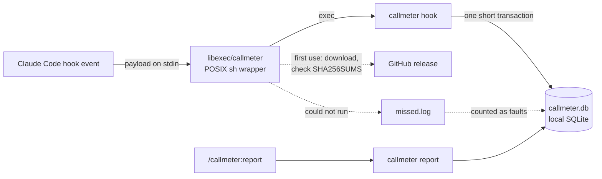

<div align="center">


# callmeter

**Claude Code plugin for tracking token usage and context growth — every tool call and sub-agent in local SQLite**

[](https://github.com/rezzminator/callmeter/actions/workflows/ci.yml)
[](./CHANGELOG.md)
[](./LICENSE)
[](#-quick-start)
[](https://docs.claude.com/en/docs/claude-code/plugins)
[](https://github.com/rezzminator/professor)

[Quick start](#-quick-start) · [Reports](#-reports-token-usage-context-growth-files-and-commands) · [Privacy](#-privacy) · [Design](./docs/design.md) · [Changelog](./CHANGELOG.md)

</div>

```text
/callmeter:report files --limit 5
```

```text
callmeter files · window: since 2026-09-03 14:36 UTC · limit=5
FILE                                READ BYTES  BASH BYTES  READS  CERTAIN  CONDITIONAL  AGENTS  SIZE  WHOLE  RANGED  RE-READS  EXECS
/tmp/demo-proj/big.txt              77909       unknown     2      2        0            1       gone  1      1       1         0
/tmp/demo-proj/stats/stats.go       4404        346         8      8        0            5       gone  5      2       3         0
/tmp/demo-proj/README.md            750         33          6      6        0            5       gone  6      0       1         0
/tmp/demo-proj/data.csv             665         518         6      6        0            5       gone  5      1       1         0
/tmp/demo-proj/stats/stats_test.go  486         0           2      2        0            1       -     2      0       1         0
note: 1 calls denied by permission
note: 2 calls refused by Claude Code
note: 2 snippets unparsed: script-body
note: 1 Bash calls skipped by the parser (relative or missing cwd, or no command)
note: 2 Bash calls read several files or also ran one: their bytes are credited to no file in BASH BYTES
```

<sub>Real output, unedited: this repository's sanitized test sessions (toy projects) replayed through `callmeter hook` into a scratch store. SIZE reads `gone` because the toy files no longer exist.</sub>

A long-running agent rarely runs out of ideas. It runs out of context: one `go test ./...` that printed 28,000 characters, one file read whole five times, one sub-agent that re-read what its parent had already read. Claude Code keeps the transcripts, but nothing adds them up.

**callmeter** adds them up. It hooks every tool call, model request, sub-agent turn and session event, stores what each one touched and cost, and answers from that store.

## 💡 Why callmeter

- **Name the call that blew up your context.** Every model request's context size, per agent, with the calls behind its biggest jumps: the call that pushed an agent from 40K to 400K tokens has a name.
- **See what actually reached the model.** Bytes delivered per file and per command shape, Bash reads included: a `cat`, `sed -n` or `grep` of a file counts as a read of that file.
- **Find the waste worth fixing.** Files read again by the same agent, outputs just under Claude Code's 30,000-character Bash output limit, and call sequences that recur across agents, ranked by what they cost.
- **Every sub-agent and every turn.** Token split, cache writes by TTL and cache hit rate per model and agent type; an agent woken again by `SendMessage` shows each of its turns.
- **Private by construction.** One SQLite file on your machine, and callmeter sends nothing anywhere. Prompts, messages and file contents are never stored, only their byte counts.
- **Gaps are counted, never hidden.** A hook that could not record becomes a fault the reports name, never a smaller number. callmeter never changes what the model sees: no hook output, no added context, no blocked call.

## 🚀 Quick start

```sh
claude plugin marketplace add rezzminator/professor
claude plugin install callmeter@professor
```

Start a new Claude Code session: a session already running records nothing until it starts again. Its first start downloads the binary for your platform and checks it against the `SHA256SUMS` pinned in the plugin. Work as usual, then ask:

```text
/callmeter:report files
```

<details>
<summary>Requirements</summary>

- macOS or Linux, on amd64 or arm64. No Windows: the wrapper is POSIX sh.
- `curl`, and `shasum` or `sha256sum`, for the one-time binary download.
- `python3` on your `PATH` to parse the Python snippets inside Bash calls; without it they are counted as an unparsed gap, never dropped.

</details>

<details>
<summary>Run reports from a shell</summary>

The plugin's binary is cached at `{CALLMETER_HOME}/bin/{version}/callmeter` (default `~/.local/state/callmeter/bin/{version}/callmeter`). Put it on your `PATH` and the same reports run as `callmeter report {topic}`; `--json` prints one object per report for scripts.

</details>

<details>
<summary>Build from source</summary>

```sh
git clone https://github.com/rezzminator/callmeter.git
cd callmeter
CGO_ENABLED=0 go build -o callmeter ./cmd/callmeter   # Go 1.27.1
```

Point the plugin's wrapper at your build with `CALLMETER_BIN=/path/to/callmeter` (see Configuration below).

</details>

## 📊 Reports: token usage, context growth, files and commands

```text
/callmeter:report {topic} [--since D] [--project P] [--agent-type T] [--session S] [--limit N] [--json]
```

| Topic | Answers |
| --- | --- |
| `files` | files by bytes delivered, read count, distinct agents, size on disk, whole against ranged reads, re-reads, runs of the file as a script |
| `writes` | files by write count and total growth |
| `commands` | command shapes by bytes delivered (sum, p50, p95), outputs just under the 30,000-char limit, persisted outputs |
| `context` | per agent: start and peak context, mean growth, the requests that grew it most and the calls behind them |
| `sequences` | call runs that recur across agents, ranked by occurrences × bytes |
| `faults` | calls not recorded, snippets not parsed, hooks the wrapper missed, turns refused by an API error |
| `sessions` | one row per session: model, start and end, calls, agents, cwd, host |
| `prompts` | one row per prompt: calls, failures, agents, requests, tokens, wall seconds |
| `effort` | calls and turns per effort level, permission mode and agent type |
| `tokens` | the token split, thinking tokens and cache hit rate per model and agent type |
| `agents` | every sub-agent turn: start, stop, duration, prompt |
| `outcomes` | lines changed per file, commits, test runs |
| `coverage` | transcripts on disk that callmeter never recorded |
| `events` | lifecycle events by kind and value |
| `compactions` | every context compaction: trigger, tokens before and after, tokens freed, seconds spent |
| `cost` | Claude Code's own cost per session: USD, seconds in the API, in retries, in tools, per model |
| `hooks` | Stop-hook overhead: runs, total, average and longest time per hook |
| `turns` | the wall time of every turn, with its messages, background agents and effort |
| `resumes` | the cost of resuming a session cold: idle time, context size, whether the prompt cache expired, the estimated cache write |
| `waiting` | time spent waiting on you: idle prompts and permission prompts, total, median and longest |

| Flag | Meaning |
| --- | --- |
| `--since D` | a duration (`7d`, `24h`) or a date (`2026-09-01`); default the whole 30-day window |
| `--project P` | calls whose `cwd` is `P` or under it |
| `--agent-type T` | calls made by that agent type |
| `--session S` | one session |
| `--limit N` | rows per table, default 25 |
| `--json` | one JSON object (`topic`, `store`, `title`, `columns`, `rows`, `notes`) instead of the text table |

The `tokens` report over the same scratch store:

```text
callmeter tokens · window: since 2026-09-03 14:36 UTC · limit=25
MODEL                      AGENT TYPE       REQUESTS  INPUT  CACHE READ  CACHE WRITE 5M  CACHE WRITE 1H  CACHE WRITE  OUTPUT  THINKING  CACHE HIT %  THINK %
claude-sonnet-5-5          -                40        80     751947      0               107762          107762       7276    -         87.5         -
claude-haiku-4-5-20251001  -                10        90     204852      0               71009           71009        2245    -         74.2         -
claude-haiku-4-5-20251001  general-purpose  6         58     33030       41033           0               41033        935     -         44.6         -
```

Every report, column and note is specified in [docs/design.md § Reports](./docs/design.md#reports).

## 📒 What it records

- `calls`: one row per tool call: tool, sanitized input, chat or sub-agent, prompt, effort, permission mode, duration, failure, bytes produced and bytes delivered to the model, the file touched and its size, lines added and removed, commits, test runners.
- `requests`: one row per model request: model, stop reason, the token split (input, cache read, cache write at 5 m and 1 h, output, and the thinking part of the output when the transcript gives it) and the context size.
- `agents`: one row per sub-agent: type, parent call, first start, last stop, total tokens, tool uses, model.
- `agent_turns`: one row per sub-agent turn, so an agent woken again by `SendMessage` shows every turn.
- `turns`: one row per `Stop` and `SubagentStop`: effort, permission mode, background tasks, the size of the last message. A `Stop` rebuilt from the transcript after its hook was lost has these unknown.
- `compactions`: one row per context compaction: trigger, context tokens before and after, tokens dropped so far, duration.
- `session_costs`: one row per session: Claude Code's own latest cost snapshot (USD, API, retry, tool and wall time, cost per model).
- `stop_hooks`, `stop_hook_runs`: one row per Stop-hook summary and per hook run in it: a derived name (the program's basename, else a short hash; never the command), the command's size, the duration (none for an async hook).
- `turn_durations`: one row per turn: wall time, message count, background agents.
- `events`: one row per lifecycle event: session start and end, prompts (their size only), slash-command expansions, instructions loaded, compactions, stop failures, permission requests, notifications, tasks.
- `sessions`: one row per session: first and last activity, model, how it started and ended, cwd, seat, host, time zone.
- `command_parts`: every simple command inside a Bash call, with the files it read or wrote, parsed at report time.
- `faults`: every event that could not be recorded and every command part that could not be parsed, by stage; a parse fault keeps the byte count of the parser's message, never its text.

## 🔒 Privacy

The store stays on your machine; callmeter sends nothing anywhere. Its only network use is the one-time binary download.

No prompt, message or file content is ever stored: each becomes a `{name}_bytes` count. A tool input keeps its command with every heredoc body cut out, an unquoted body keeping only the `$(…)` and backquote substitutions the shell runs, then each `git commit` message and every operand an `echo` or `printf` writes to a file or into `tee` replaced by the one word `'[cut]'`, the bytes cut stored as `operand_bytes` (a command that cannot be cut safely keeps only its byte count), file paths, search patterns and read range; `content`, `old_string`, `new_string`, an edit's `edits`, an agent's `prompt` and a `description`, `query` or `target` are replaced by their byte length. Event details keep only their shape, numbers, booleans, a short list of enum-like keys (`type`, `status`, `source`, `model`, `file_path`, …) and the known labels of a stop failure's `error` and a session end's `reason`; every other string becomes its byte count. A failed call keeps only its exit code or an outcome label, and a parse fault only the size of the parser's message. Commit messages given as `git commit` operands, the text an `echo` or `printf` writes to a file, patch lines, command output, heredoc bodies and error text are never stored. The rest of a command is stored as written, so text it carries in another form stays: a message assigned to a variable before the commit, a commit inside a `bash -c` or `ssh` script string, a word an `echo` prints to the terminal. `callmeter redact` rewrites rows already stored under these rules.

## 🧠 How it works



- Every registered event runs the plugin's wrapper with `hook`. The wrapper finds the `callmeter` binary for this plugin version and `exec`s it with the hook's payload on stdin.
- On the first `SessionStart` after install, the wrapper downloads the binary for your platform from the GitHub release of this version, checks it against the `SHA256SUMS` committed in the plugin, and caches it under `CALLMETER_HOME`. Every later run uses the cache.
- The binary writes one short SQLite transaction per event and exits 0 on every path. A hook it could not serve is logged to `missed.log` with the writer's pid at the end of its reason (` (pid N)`) and counted as a fault on the next run, so a gap shows in the reports instead of a smaller number.
- Reports read the same store. Each report run first prunes rows older than 30 days, archiving them to `archive.db`, then fills missing sub-agent parent and type from metadata for live or quiet sessions before settling every session with no hook and no transcript write for an hour from its transcripts: calls left in flight, requests no hook wrote, a turn end whose `Stop` or `StopFailure` hook was lost.

Every hook but `SessionStart`, `SessionEnd` and `StopFailure` is async: nothing waits for callmeter before a tool runs.

## ⚙️ Configuration

| Variable | Effect |
| --- | --- |
| `CALLMETER_HOME` | where the store, logs and binary cache live; default `${XDG_STATE_HOME:-$HOME/.local/state}/callmeter` (`XDG_STATE_HOME` counts only when absolute) |
| `CALLMETER_BIN` | an executable the wrapper runs instead of resolving one (development) |
| `CALLMETER_RELEASE_BASE` | where the wrapper downloads binaries from; default `https://github.com/rezzminator/callmeter/releases/download` |
| `CALLMETER_E2E` | `1` enables the end-to-end tests (development) |

Under `CALLMETER_HOME`: `callmeter.db` (the store), `callmeter.log` (JSON lines), `missed.log`, `archive.db` (pruned rows) and `bin/{version}/callmeter` (the cached binary).

## ❓ FAQ

<details>
<summary>Why not store it in the plugin's data directory?</summary>

Claude Code gives each plugin a data directory per seat: `{CLAUDE_CONFIG_DIR}/plugins/data/callmeter-{marketplace}`. If you run several config dirs (several accounts, or a fleet controller such as Professor), each would get its own store, and calls that belong together would be split. The `callmeter` CLI and other tools also need to find the store without any plugin environment. So the store lives at `CALLMETER_HOME`, one per machine, and each row records the seat it came from.

</details>

<details>
<summary>Does it run on Windows?</summary>

No. The wrapper is POSIX sh, and binaries are released for macOS and Linux on amd64 and arm64 only.

</details>

<details>
<summary>What happens when a hook cannot run?</summary>

The hook still exits 0 and the call goes on untouched. If the wrapper could not find or download the binary, it appends one line to `{CALLMETER_HOME}/missed.log`; the next run turns it into a `binary` fault, and `/callmeter:report faults` shows it. If the hook binary is stopped by SIGTERM, SIGINT or SIGHUP before it recorded the event, it appends its own line there, which becomes a `terminated` fault beside the `binary` ones. Each missed reason is `{reason} (pid N)`, naming the wrapper's or binary's own pid; the tab-separated layout stays the same. Distinct writers' same-second lines remain distinct faults, while replaying identical bytes adds none. A failure inside the binary is a fault of its own stage. Gaps are counted, never hidden.

</details>

<details>
<summary>I use Professor, which has its own recorder. Will calls be counted twice?</summary>

Professor's built-in recorder writes its own store, so the two never mix rows, but both hooks run on every call. Run one recorder per chat: either the plugin or Professor's built-in hook, not both.

</details>

## 💬 Help

- Start with the [FAQ](#-faq) and [docs/design.md](./docs/design.md), which specifies every behaviour.
- `/callmeter:report faults` and `/callmeter:report coverage` show what callmeter itself missed.
- Questions and bugs: [open an issue](https://github.com/rezzminator/callmeter/issues/new/choose); [SUPPORT.md](./SUPPORT.md) lists what to include.
- Security or privacy problems: report them privately, as [SECURITY.md](./SECURITY.md) describes.

## 🤝 Contributing

Contributions are welcome: read [CONTRIBUTING.md](./CONTRIBUTING.md), then pick a [good first issue](https://github.com/rezzminator/callmeter/issues?q=is%3Aissue+is%3Aopen+label%3A%22good+first+issue%22). Everyone taking part follows the [code of conduct](./CODE_OF_CONDUCT.md).

```text
cmd/callmeter/            the binary
internal/callmeter/       the store, with cmdparse/, report/, command/
internal/hookentry/       the hook entry and its captured payload fixtures
internal/wrappertest/     tests of the sh wrapper
internal/…                clock, sqlitedb, runner, testjail, paths, applog
e2e/                      real Claude Code runs (CALLMETER_E2E=1)
plugins/callmeter/        only what installs: manifest, hooks, wrapper, skill
scripts/                  build-release.sh, release-check.sh, leak-check.sh, sanitize-capture.py, reconcile/
docs/                     design.md, testing.md
```

Go 1.27.1, CGO off. The design is [docs/design.md](./docs/design.md); how to test is [docs/testing.md](./docs/testing.md).

```sh
go test ./internal/<pkg>/ -run <Test> -count=1   # affected
go test ./...                                     # full
go vet ./... && gofmt -l .                        # lint; gofmt prints nothing
scripts/leak-check.sh
claude plugin validate --strict .
claude plugin validate --strict plugins/callmeter
scripts/release-check.sh
CALLMETER_E2E=1 go test ./e2e/... -count=1        # real Claude Code, costs tokens
```

Work lands on `develop`, the default branch; `main` is release-only. A release bumps the version places (`plugins/callmeter/.claude-plugin/plugin.json`, the marketplace entry, the README badge, the CHANGELOG heading), passes `scripts/release-check.sh --release`, and is tagged `v{version}` on `main`; `release.yml` builds the four binaries and publishes them.

## 🎓 Built with Professor

callmeter is built and maintained with [Professor](https://github.com/rezzminator/professor), a fleet controller and discipline layer for Claude Code, Codex and OpenCode: chats that message each other, agents held to the project's rules, and gated releases. Professor runs fleets of chats and sub-agents, and callmeter is how it measures what each one actually did.

## License

[MIT](./LICENSE)

<sub>Keywords: Claude Code plugin · Claude Code hooks · tool call telemetry · token usage · context window · prompt cache · cache hit rate · sub-agent tracking · SubagentStop · PostToolBatch · SQLite · observability · cost · Professor</sub>
